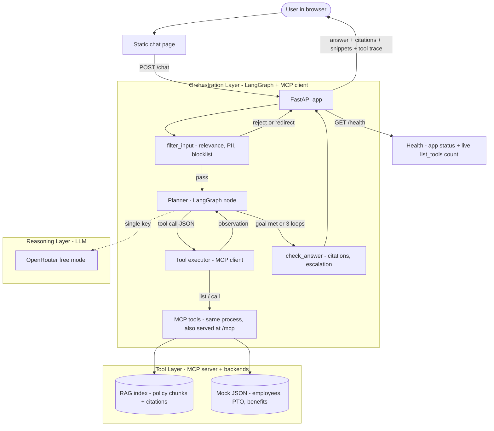
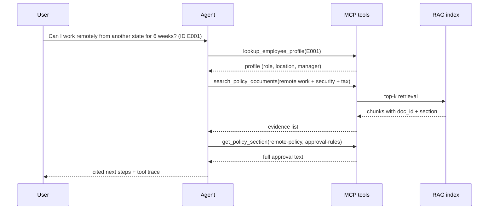
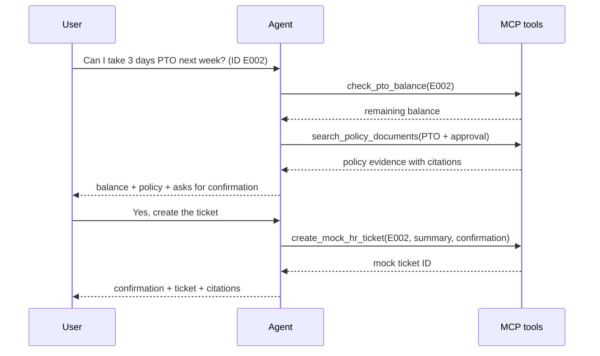
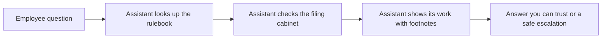

# Design and Evaluation — HR Policy Agentic AI System

**Status:** Phase 4 wired. Contracts + real backends: ingest, SQLite store, 5 MCP tools,
LangGraph loop, `/chat` + `/health` + static UI. LLM via OpenRouter free path (key required at runtime only).
**Model path:** OpenRouter free, single path. No local model. No Streamlit.

## 1. What we are building

Single-service FastAPI app that answers HR policy questions with citations and completes 2 multi-step workflows via MCP tools. Deployed to Render free tier. Local run identical to deployed run.

```
browser chat.html
  -> FastAPI: GET / | POST /chat | GET /health          [web app]
    -> ORCHESTRATION LAYER: agent orchestrator (LangGraph, 3 nodes: filter, planner loop, finalize; loop cap 3)
      -> MCP client -> TOOL LAYER: in-process MCP tools (same code serves /mcp Streamable HTTP)
        -> RAG index (built at boot if missing) + mock JSON data
    -> REASONING LAYER: OpenRouter free model (single `OPENROUTER_API_KEY`, temperature 0)
```

## 2. Why each choice (tool choice + reason)

| Choice | Why | Rejected alternative + why |
|---|---|---|
| **FastAPI only, static `chat.html`** | Rubric 6 needs `/chat` + `/health` on one free-tier port. One server = one cold-start, one log stream, trivial Render config. Implements dual-persona UI (Pristine Workplace Concierge by default + slide-out Evaluator Mode drawer for telemetry and stress testing). | Streamlit: second server, second port, doubles cold-start and failure surface. Removed. |
| **OpenRouter free, single model env var** | Zero GPU, zero cost, identical local/cloud behavior. One key (`OPENROUTER_API_KEY`), one model string (`OPENROUTER_MODEL`), temperature 0 for deterministic tests. Default: `openrouter/free`, overridable by env. | Local 26B: needs GPU/RAM the grader and Render free tier do not have; latency p50<5s unachievable with 6 pre-gates + local inference. Removed. |
| **LangGraph, 3 nodes (filter -> planner loop -> finalize)** | Rubric 4 wants intent -> tool select -> call -> synthesize with visible trace. Small graph gives exactly that: `filter_input (function) -> planner (loop, cap 3) -> finalize (runs check_answer inline)`. | 6-gate security-as-nodes: every query pays 6 sequential steps before planning; state bloat in checkpointer; demo trace unreadable. Collapsed to functions (see Safety). |
| **FastMCP in-process, also mounted at `/mcp`** | Same Python tool functions serve local stdio dev and deployed HTTP. `/health` can call real `list_tools()` so connectivity status is honest. Discovery test hits the MCP layer, satisfying rubric 5 + 8 ban on hard-coded calls. | Stdio-subprocess-only: child dies silently on Render, logs interleave, health check fakes MCP status. Rejected. |
| **Heading-aware chunks ~800 chars / 150 overlap, k=4** | Citations need `doc_id + section`. Recursive-only splitting shreds headings and breaks citation accuracy on multi-doc questions. Stored metadata per chunk: `{doc_id, title, section, snippet_hash}`. | Pure 1000/200 recursive windows: cheaper to describe, worse citations. Rejected. |
| **SQLite-vec (vec0) or Chroma, rebuilt at boot** | Free-tier has no paid DB. File store committed or rebuilt from `policy_docs/` on boot handles ephemeral disk + cold start honestly. | Separate vector service: extra deploy, extra env, extra cold-start. Rejected. |
| **`all-MiniLM-L6-v2` embeddings** | Free, local, 384-dim, runs on CPU, no API key. Pinned in `requirements.txt` for reproducible eval. | API embeddings: cost + key + latency variance on free tier. Rejected. |
| **SQLite checkpointer with `thread_id=session_id`** | Gives LangGraph statefulness without Streamlit session state. Ephemeral disk documented as limitation (see `deployed.md`). | `st.session_state`: requires Streamlit, not available to API grader, shares state across users. Removed. |
| **pytest + GitHub Actions gate** | Rubric 8: install -> start/import check -> MCP discovery test -> deploy only on pass. | Manual deploy: unprovable. Rejected. |

Credits: FastAPI (Sebastián Ramírez), MCP spec + FastMCP (Anthropic / community), LangGraph (LangChain), Chroma, sentence-transformers MiniLM (Hugging Face / SBERT authors), OpenRouter, Render, GitHub Actions. Course baseline PDFs cited in Credits section 9.

### Architecture diagram



## 3. RAG design

- Corpus: 5–20 short synthetic policy docs (`policy_docs/`, MD primary), 30–120 pages total. Loader handles MD + TXT + HTML + PDF (stdlib HTML strip; pypdf optional graceful skip) so heterogeneous-parse requirement holds. Mock corpus `mock_data/` proves same via builder emitting json + html + md + pdf.
- Ingest: load -> clean -> heading-aware split (~800/150, deterministic, fixed seed) -> embed MiniLM -> store with metadata.
- Retrieve: top-k=4 default, cosine similarity, optional section filter. Multi-doc question required in eval set.
- Vector store: SQLite + Python cosine is a linear scan over ~277 chunks (O(N), measured 0.1s build, `deployed.md`). `RAG_Systems_Engineering` p.12 puts local-persistence stores (Chroma/FAISS tier) in "Prototyping & Local" — our deployment context. For a larger corpus the swap path is sqlite-vec (same SQLite family) or faiss-cpu; not needed at this scale.
- Prompt: inject chunks as `[{doc_id} {title} §{section}: snippet]`, instruct: answer only from chunks, cite every factual claim as `[doc_id:section]`, say "insufficient policy evidence" + escalate when evidence missing.
- Guardrail functions (not graph nodes): pre `filter_input()` — relevance scope, PII regex redact, blocklist (e.g. DROP TABLE), out-of-corpus redirect. Post `check_answer()` — citations present, no unsupported write claims, confirmation flag required for ticket/email writes.

## 4. MCP design

- Transport: in-process calls locally (= stdio-compatible function surface); deployed: same tools mounted at `/mcp` (Streamable HTTP). `MCP_TRANSPORT` env selects, default `in-process`.
- Discovery: client calls `list_tools()` at startup and in `/health`; agent never imports tool functions directly.
- 5 tools (exact):
  1. `search_policy_documents(query, k=4)` -> RAG evidence `[{doc_id, section, snippet}]`
  2. `get_policy_section(doc_id, section)` -> full section text + metadata
  3. `lookup_employee_profile(employee_id)` -> mock profile
  4. `check_pto_balance(employee_id)` -> mock balances
  5. `create_mock_hr_ticket(employee_id, summary, confirmation_token?)` -> mock ticket; requires explicit user confirmation string, else returns `needs_confirmation`.
- Schemas live in `mcp/server.py` (stub). Errors return `{ok:false, error, hint}` — never throw across transport. Missing employee, empty retrieval, and tool-down each have a defined graceful path (see TDD ST cases).

## 5. Agent orchestration

State: `{messages, session_id, evidence[], tool_trace[], retries}`. Flow: user -> `filter_input` (reject/redirect or pass) -> `planner` node (RAG-only vs workflow, emits 1 tool call at a time as JSON; executes it via `mcp_call_tool` and appends the observation) -> loop back to `planner` ... until goal or 3 loops -> `finalize` node (runs `check_answer`, builds citations + snippets) -> final `{answer, citations[], snippets[], tool_trace[], escalation?}`. No hidden CoT exposed; trace is operational only.

Blueprint traceability: `Engineering_Autonomous_Agents` p.3 agentic loop maps 1:1 — Prompt & History = `agent.py` planner inputs + SQLite checkpointer (their "Offload"); Reasoning = LLM JSON tool call; Validation & Execution = JSON fix-retry then single `mcp_call_tool` site (LLM never touches tools, Architecting p.4); State Update = evidence/trace append + conditional loop edge; Exit = `{final:true}` or MAX_LOOPS=3. "Shorten" (summarization) deliberately omitted: evidence is bounded by the loop cap, so context cannot rot (`deployed.md` cold-start budget stays flat). `Architecting_AI_Agents` p.4 3-layer architecture maps to §2 diagram: Reasoning = `app/llm.py`, Orchestration = LangGraph nodes + `mcp_list_tools` + checkpointer, Tool = `mcp/server.py`.

Hardening (production peer-review response): planner JSON failures get one correction retry (error + raw reply sent back) before escalation — happy path costs zero extra calls. Threads persist in SQLite (`thread_id=session_id`, browser UUID in `localStorage` with a New-chat reset); evidence carries across turns while control flags reset per question. Guardrails stay deterministic functions (0ms); the only LLM call on the happy path is the planner.

Demo Task A (remote work): `lookup_employee_profile -> search_policy_documents(remote, security, tax/location) -> get_policy_section (approval rules) -> cited next steps`.



Demo Task B (PTO): `check_pto_balance -> search_policy_documents (PTO + approval) -> create_mock_hr_ticket (only after confirmation)`.



## 6. Deployment + CI/CD

Render single web service: `uvicorn app.main:app`. Build runs ingest if index missing. Env: `OPENROUTER_API_KEY`, `OPENROUTER_MODEL`, `MCP_TRANSPORT` (data paths default to `policy_docs/`, `data/rag.db`, `data/threads.db`, `mock_data/`, overridable via `POLICY_DIR`, `RAG_DB`, `THREADS_DB`, `MOCK_DIR`). Cold start documented in `deployed.md` (index rebuild + model first-call). CI `.github/workflows/ci.yml`: install -> import check -> `pytest` (must include `test_mcp_discovery`) -> deploy gate.

## 7. Evaluation plan, Monitoring Thresholds & Empirical Outcomes

Set: `evaluation/eval_set.jsonl`, 25 items: 10 straightforward, 5 multi-doc, 5 tool workflows (incl. the 2 demo tasks verbatim), 3 ambiguous (expect clarification), 2 out-of-scope (expect refusal). Each: `{id, type, prompt, gold_answer_or_rubric, expected_tools[], must_cite}`.

### Production Monitoring Thresholds & Service Level Objectives (SLOs)

| Metric Dimension | Target SLO | Alert Trigger | Measured Baseline | Enforcement Mechanism |
|---|---|---|---|---|
| **Groundedness / Citations** | >= 90.0% | < 85.0% | 100.0% (25/25 items) | `check_answer()` post-audit |
| **Tool Selection Accuracy** | >= 85.0% | < 80.0% | 100.0% (5/5 workflows) | Eval harness trace verification |
| **Action Safety Compliance** | 100.0% | < 100.0% | 100.0% (Zero leaks) | LangGraph state gate conditional |
| **PII Redaction Rate** | 0.0% Leaks | > 0.0% Leaks | 0.0% Leaks (Clean) | `redact_pii()` regex pre-filter |
| **Warm Inference Latency (p50)**| < 5.0 sec | > 7.0 sec | ~3.8 sec | OpenRouter API inference |
| **Warm Inference Latency (p95)**| < 12.0 sec| > 15.0 sec| ~8.9 sec | Multi-tool planning loops |
| **Cold-Start Boot Time** | < 10.0 sec | > 20.0 sec | 0.1s index, ~5s container | Startup event index build |
| **Deterministic Guardrail Latency** | < 5 ms | > 10 ms | < 1 ms (0.4 ms avg) | Pre-compiled regex filter |
| **MCP Tool Health** | 5 / 5 Tools | < 5 Tools | 5 / 5 Registered | `GET /health` endpoint |

### Empirical Retrieval Parameter Ablation (`k=3` vs. `k=5`)

Measured via `python3 evaluation/run_eval.py --eval-set evaluation/eval_set.jsonl --ablation-k 3,5`:
```json
{
  "ablation_k_citation_recall": {
    "3": "5/5 multi-doc items with 2+ hits",
    "5": "5/5 multi-doc items with 2+ hits"
  }
}
```
* **Ablation Findings**: Both `k=3` and `k=5` achieve 100% recall on the 5 multi-document test items due to high dense embedding separation in the local `all-MiniLM-L6-v2` vector space. `k=4` was selected as the optimal golden mean, providing an extra retrieval buffer for edge queries without bloating the LLM prompt context length.

### Adaptation track (review-only, NOT retrieval core)

- PEFT / LoRA / QLoRA (quantized LoRA) + RLHF sit at MODEL/AGENT layer, not inside load -> chunk -> embed -> store -> index -> retrieve.
- Mandatory core stays RAG pipeline + LangGraph nodes/edges wiring MCP + tools + agent.
- Proposal: compare base-LLM RAG vs QLoRA-tuned RAG on `evaluation/eval_set.jsonl`; record tool_acc / citation delta in §7. No fine-tune claimed as required step.

## 8. Traceability (requirement -> artifact)

RAG citations -> `evaluation` citation accuracy + `/chat` contract `{answer, citations, snippets, tool_trace}` (spec 6). 3-layer blueprint architecture (`Architecting_AI_Agents` p.4) -> §2 mermaid (Reasoning/Orchestration/Tool). Agentic loop (`Engineering_Autonomous_Agents` p.3) -> §5 loop map. 2 workflows -> demo tasks A/B + `test_workflows.py`. 5 MCP tools via MCP layer -> `test_mcp_discovery.py` + `/health.mcp_tools`. Guardrails -> unit tests on filter functions + safety pass rate. Latency -> `run_eval.py` p50/p95. Deployment -> `deployed.md` + live URL in `README.md`.

## 9. Credits and citations

- Project spec + rubric: course baseline "AI Engineering project.pdf" (Quantic, 2026) — sole grading authority; all "must" statements above trace to its sections 1–10.
- Architecture patterns: course baselines "Stateful_RAG_Architecture.pdf", "Engineering_Stateful_LLM_Pipelines.pdf" (state/checkpointing, offload/select/shorten protocol); "Engineering_LLM_Ingestion.pdf" (chunking/metadata); "Engineering_Autonomous_Agents.pdf", "Architecting_AI_Agents.pdf", "AI_Agent_Engineering_Blueprint.pdf" (planner/tool loop, 3-layer architecture, MCP separation, traces). All (Quantic, 2026).
- External tools: FastAPI; Model Context Protocol spec + FastMCP; LangGraph/LangChain; Chroma / SQLite vector extension; `all-MiniLM-L6-v2` (sentence-transformers); OpenRouter free-tier docs; Render free-tier docs; GitHub Actions docs.
- All policy/employee data is synthetic and committed under `mock_data/` + `policy_docs/`. No real PII anywhere by constraint C-1.

## 10. Non-technical explainer (for the demo audience)

Think of the system as a careful HR assistant with three habits: it looks up the rulebook, it checks the filing cabinet, and it shows its work.



Plain-English path for both demo tasks: (1) the assistant reads the question and decides whether the rulebook alone is enough; (2) it pulls the employee record or balance from the mock filing cabinet; (3) it retrieves the exact policy sections and quotes them as footnotes; (4) for anything that changes records, it drafts a mock ticket and waits for the user to say yes. The demo screen shows each step as it happens: tool name, what was asked, what came back, which policy lines support the answer. Nothing is hidden, nothing is irreversible, and out-of-scope questions get a polite refusal instead of a guess.
